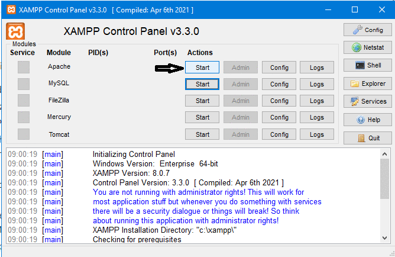

<h1 algin="center">Applicazione Node che aiuta a segnalare posti inquinati nelle vicinanze</h1>

  
Sommario

  <ol>
    <li>
      <a href="#informazioni-sul-progetto">Informazioni sul progetto</a>
      <ul>
        <li><a href="#costruito-con">Costruito con</a></li>
      </ul>
    </li>
   <li><a href="#descrizione">Descrizione</a>
     <ul>
        <li><a href="#struttura-repository">Struttura Repository</a></li>
        <li><a href="#Download-e-testare-app-in-locale">Download e testare app in locale</a></li>
      </ul>
    </li>
   <li><a href="#licenza">Licenza</a></li>
  <ol>

<!-- Informazioni sul progetto-->
## Informazioni sul progetto
 La finalità di questo progetto è quella di realizzare una applicazione Node che aiuti a segnalare posti inquinati nelle vicinanze.
 L'app permette l'upload di foto per certificare l'inquinamento ambientale in atto , e l'indirizzo/posizione della stessa.
 L'applicazione fornisce un endpoint per poter visualizzare la lista di tutti i posti segnalati.
    
 L'app è dotata di un database, la sua funzionalità è quella di memorizzare: il nome dell'immagine , l'indirizzo e le coordinate del luogo dell'inquinamento.
 Per realizzare il database è stato utilizzato MySQL che fa parte dei sistemi di gestione di basi di dati relazionali più popolari al mondo .
 
 Per definizione MySQL è un DBMS(Database management system) relazionale. Cio significa che la gestione dei dati si basa su un modello di database tabellare. Tutti i dati che MySQL elabora vengono salvati nelle tabelle che si possono mettere in relazione tramite chiavi (keys)
 
 Per questa applicazione il database è costituito da una sola tabella images.
    
 Per ulteriore informazioni su MySQL visitare il link https://www.mysql.com/it/ 
    
 <h4>Ambiente di sviluppo</h4>
 Prima di utilizzare MySQL è necessario preparare un'ambiente di sviluppo. Per far questo si è utilizzato il software XAMPP.
 XAMPP è una distribuzione Apache gratuita per creare un server web multipiattaforma tramite tecnologie open source.
 XAMPP è composto da Apache HTTP Server, MySQL(o MariaDB), PHP e Perl. La X iniziale fa riferimento al suo essere multipiattaforma: infatti compatibile con i sitemi operativi Windows, Linux, Mac .
    
 Cos'è Apache ? :
 Apache è un web server locale che in questa aplicazione permette di testare in locale tutti i servizi legati al database.

 (Per ulteriori informazioni e download visitare il link: https://www.apachefriends.org/it/index.html).

 #### <h3>Costruito con:</h3>
 <b>Framework</b> utilizzati sono:
 * [Express] (https://expressjs.com)

    
 <b>API utilizzate</b>
   * [API JavaScript "Geolocation] 
   * [API esterna MAPQUEST] (https://developer.mapquest.com)
 
 <b>Middleware node.js</b>
   * [Multer utilizzato per il caricamento dei file]

 <b>Database</b>
   * [MySql]

<!--Descrizione-->
## Descrizione
#### Struttura Repository
  Il repository è strutturato nel seguente modo:  
 <ol>
   <li> Cartella <b>controllers</b> </li>
   <li>Cartella <b>middlewares</b></li>
   <li>Cartella <b>models</b></li>
  <li>

    
Cartella <b>public</b>

    <ol>
      <li>Cartella <b>CSS</b></li>
      <li>Cartella <b>JS</b></li>
      <li>Cartella <b>favicons</b></li>
      <li>Cartella <b>images</b></li>
    <ol>
   

  </li>
   <li>Cartella <b>routes</b></li>
   <li>Cartella <b>views</b></li>
   <li>file <b>.env</b></li>
   <li>file <b>app.js</b></li>
   <li>file <b>database.js</b></li>
   <li>file <b>db-img-indirizzi.sql</b></li>     
   <li>file <b>package-lock.json</b></li>
   <li>file <b>package.json</b></li>
 </ol>

 ####  Download e testare app in locale
  L'app può essere testata in locale eseguendo i seguenti passaggi:

   * Eseguire il download del repository
       
     
   * Installare le dipendeze che sono riportate nel file package.json 
       
     
   
   * Download di XAMPP al seguente link:https://www.apachefriends.org/it/index.html.
     
     Installazione di XAMPP
       
   * Aprire XAMPP.
      La schermata iniziale di XAMPP installato su un dispositivo con sistema operativo Windows10 si presenta in questo modo.
     
      
      
    Per questa applicazione ci interessa il servizio Apache che come gia detto in precedenza è un web server locale, e il servizio MySQL.
    
   *  Avviare i servizi Apache e MySql attraverso i pulsanti start.
    
      .gif)
   
   
   *  Per creare il database bisogna raggiungere l'ambiente di sviluppo "phpAdmin". 
      Utilizzando il pulsante "Admin" relativo al modulo MySql si aprirà in automatico il 
      browser è verremo indirizzati alla pagina phpAdmin.
      
      
    
     Dalla paggina principale di phpAdmin cliccare su importa .
     Andare nella cartella del repository presente sul proprio dispositivo e Caricare
     il file db-img-indirizzi.sql 
     Una volta caricato lasciare tutte le altre impostazioni invariate ed fare esegui.
     In questo modo viene generato in locale un database con una struttura uguale a quella utilizzata in fase di progettazione dell'app.
    
   *  Ora si può testare l'app.
      Aprire il la cartella del repository attraverso una shell (interprete dei comandi) ed eseguire il comando "npm start".
     
     
      
      Una volta che l'applicazione si è avviata aprire il browser ed andare al seguente 
      link: http://localhost:3000/

 ## Licenza
    Distribuito con licenza MIT. Vedere "LICENSE" per ulteriori informazioni.
